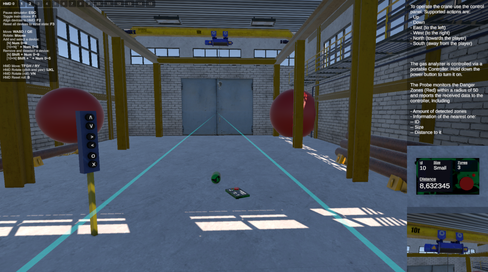
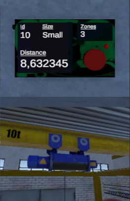

# GWPro VR Task

This repo contains a VR project
## Crane

### Base Requirements

- [X] The panel to control the crane must use 6 button:
  - [X] Up
  - [X] Down
  - [X] West (~right)
  - [X] East (~left)
  - [X] North (~to the player)
  - [X] South (~away from the player)
- [X] The movement is gradual-wise, not step-wise.
- [X] Speed of each axis can be set independently.
- [X] Speed of each axis is hardcoded. *It uses serialized fields*.
- [X] Control process must rely on C# or UnityEvent-s to receive user inputs. *This project uses both types of events*.

### Bonus

- [X] When the crane hook is moving Up or Down the crane's tube is rotating (1) and emits the sound effects (2). *It stops and continues with the user input*.

---

## Gas Analyzer

### Base Requirements

- [ ] Contains 4 components:
  - [x] Mobile Panel (~controller)
  - [X] Display on it
  - [X] External Probe
  - [ ] Connecting Cable. *It does not, please check explanation below*.
- [X] Controller must have Power Button.
- [X] Controller must be grabbable.
- [X] Switching power mode (ON/OFF) on the Controller must take precisely 3 seconds. *In my implementation this value is serialized and can be changed.*
- [X] Switching power mode works like a toggle: from ON to OFF and vise versa.
- [X] Progress of switching power is provided via visible indicator.
- [X] Display is inactive when power mode is OFF. *When power is OFF, the detection process of the probe is also inactive. Both enable it back when power is ON again*.
- [X] Display must show the distance to the object with 'DangerZone' tag. *It does. It also shows additional information about the zone, such as ID and size*.
- [X] Distance must be dynamically calculated.
- [X] Probe must be grabbable.

### Cable Explanation

I've never ever made 3D rope-like object, so I tried my best:
- I tried to use math functions and LineRenderer component but the results was awful. It was not physics-friendly at all, and it looked bad.
- I tried 'Optimized Ropes And Cables' free Unity asset, but it appeared to be the same math functions.
- I watched YouTube tutorials and tried to replicate Hinge Joint approach. In this case 'joints' was flying and flicking around broking any order. I started with this approach and ended with this, but it was no match to tutorials nor my imagination.

After I'd spent around 2-3 hours trying to make it work I decided to move on and get back to it later. If you are reading it then I didn't make it in time.
I don't know what level of quality of cable you expected. Maybe I took it harder than it was intended. But I decided that my candidates were too bad to share.

### Bonus

- [ ] Make Display appear gradually. *It doesn't exactly, but power switching indicator does*.
- [ ] Make UI of the Display beautiful. *I don't actually think it's beautiful. It is not ugly though*.
- [x] Support detection of multiple Danger Zones and showing distance to the nearest one. *It does*.

---

### UI

- [X] Provide base UI to show hints and basic instructions.

---

### EXTRA

1) In order to easily monitor GasAnalyzer's Display and Crane working I added 2 cameras on set

2) You might find Unity's XR Toolkit artifacts in the scene or folders.